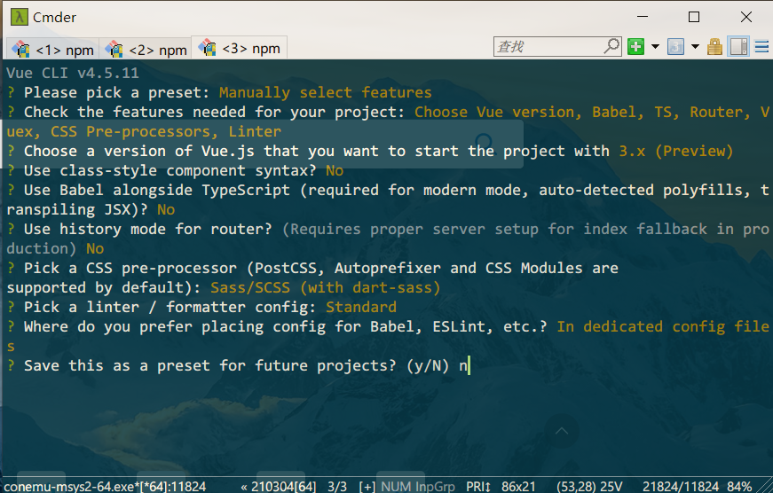

# 项目启航
> 该项目主要使用vue3技术栈+typescript

## 项目初始化
### 一、项目准备
#### 版本
- node v12.18.4
- @vue/cli v4.5.11

#### 安装Vue-cli(版本需要v4.5及以上)

```shell
npm i -g @vue/cli

#查看版本
vue -V
```

### 二、项目创建

```shell
vue create vue3-element-admin
```

#### 步骤截图

-  手动选择配置


- 选择项目所需配置

  

- Vue版本选3.x
- 关于TypeScript两个选项 都选no
- 路由模式 使用Hash模式
- 选择 dart-sass 预处理器
- 选择 eslint配置 Standard
- 选择lint to save
- 最后一项不保存为preset 选择n
回车创建

项目最终配置截图


 
## 项目规范配置(可以不用配置 每次提交代码会比较慢)
- commitlint 约束commit messag规范
- lint-stage 提交代码时进行代码lint检查并fix
- husky git hooks工具 git操作时可运行指定钩子命令

### 配置commitlint
> 规范git commit message, 约束commit提交格式

```sh
git commit -m <type>(<scope>?): <subject>
```
type(必须):
- feat：新功能（feature）
- ci：自动化流程配置修改
- fix：修补bug
- docs：文档更新（documentation）
- style：修改了空格、缩进等（不影响代码运行的变动）
- refactor：功能重构（即不是新增功能，也不是修改bug的代码变动）
- test：增加测试
- chore：构建过程或辅助工具的变动
- perf：优化相关，比如提升性能、体验。
- revert：回滚

scope（可选）:

scope用于说明 commit 影响的范围

subject(必须):

commit简短描述

```sh
# example
git commit -m "some message" # fails
git commit -m "fix: some message" # passes
```

#### 安装commitlint

```bash
# Install and configure if needed
npm install --save-dev @commitlint/{cli,config-conventional}

# 执行该命令 会在当前项目下创建commitlint.config.js文件 并写入如下配置内容
echo "module.exports = {extends: ['@commitlint/config-conventional']};" > commitlint.config.js
```

#### 安装lint-stage husky (配合commitlint使用)
> lint-stage代码lint工具 只处理暂存区文件，husky git钩子工具 

```sh
# 安装lint-stage v10.5.4 和husky v4.3.8
npx mrm lint-staged
```

执行完，package.json会自动添加如下内容：

```json
  {
    "husky": {
      "hooks": {
        "pre-commit": "lint-staged"
      }
    },
    "lint-staged": {
      "*.{js,vue}": [
        "eslint --fix"
      ]
    }
  }
```

修改为如下

```json
{
  "husky": {
    "hooks": {
      "pre-commit": "lint-staged",
      "commit-msg": "npx --no-install commitlint --edit $1"
    }
  },
  "lint-staged": {
    "src/**/*.{js,vue,ts}": [
      "vue-cli-service lint"
    ]
  }
}
```

### 验证配置
> git commit时 会先对暂存区文件进行代码格式化 然后检查commit message规范

commit 失败


commit 成功


